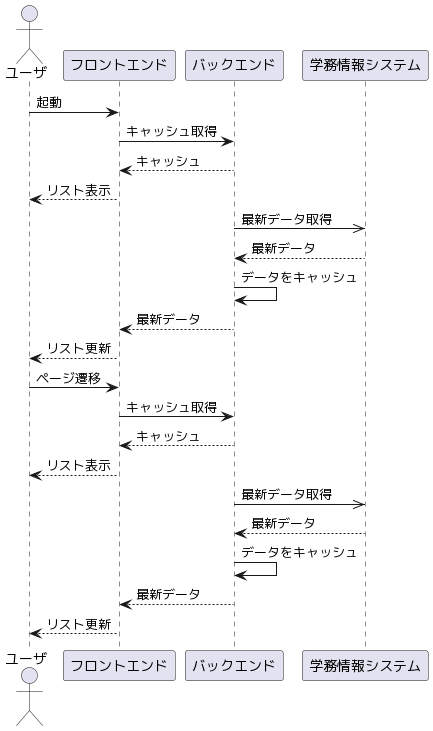
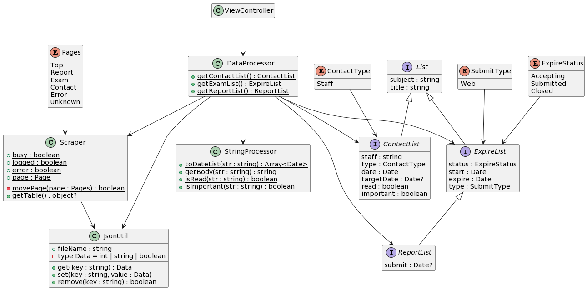

# GakujoViewer

## 目次

- [設計](#設計)
- [環境構築](#環境構築)
- [詳細な開発方法](#詳細な開発方法)
- [開発テクニック](#開発テクニック)
- [Additional Commands](#additional-commands)
- [Project Structure](#project-structure)
- [Using static files](#using-static-files)

## 設計

とりあえず情報を表示するだけの場合の設計
(レポート提出などの操作には対応していない)

### シーケンス図



<details>
    <summary>PlantUML</summary>

    actor "ユーザ" as user
    participant "フロントエンド" as front
    participant "バックエンド" as back
    participant "学務情報システム" as gakujo

    user -> front : 起動
    front -> back : キャッシュ取得
    front <-- back : キャッシュ
    user <-- front : リスト表示
    back ->> gakujo : 最新データ取得
    back <-- gakujo : 最新データ
    back -> back : データをキャッシュ
    front <-- back : 最新データ
    user <-- front : リスト更新
    user -> front : ページ遷移
    front -> back : キャッシュ取得
    front <-- back : キャッシュ
    user <-- front : リスト表示
    back ->> gakujo : 最新データ取得
    back <-- gakujo : 最新データ
    back -> back : データをキャッシュ
    front <-- back : 最新データ
    user <-- front : リスト更新
</details>

### クラス図



<details>
    <summary>PlantUML</summary>

    hide empty fields
    hide empty methods

    package main {
        package api {
            class GakujoApi {
            }
        }

        package scraper {
            class Scraper {
                -url: string
                -browser: Browser
                -page: Page
                +init(): Promise<void>
                +movePage(page: Pages): Promise<boolean>
                +getTable(): Promise<object | null>
            }

            class AppBrowser {
                -url: string
                -browser: Browser
                -page: Page
                +login(): Promise<void>
            }

            enum Pages {
                Top
                Report
                Exam
                Contact
                Error
                Unknown
            }
        }

        package util {
            class DataUtil {
                {static} +toContactList(table: object): ContactData[]
                {static} +toExamList(table: object): ExpireData[]
                {static} +toReportList(table: object): ReportData[]
            }

            class StringUtil {
                {static} +toDateArray(str: string): Date[] | null
                {static} +getBody(str: string): string
                {static} +isRead(str: string): boolean
                {static} +isImportant(str: string): boolean
            }

            class FileUtil {
                {static} +LOGIN_COOKIE: string
                {static} +CACHE: string
                {static} +init(): void
                {static} +write(file: string, data: string): Promise<boolean>
                {static} +read(file: string): Promise<string
            }

            class CacheUtil {
                {static} +REPORT_LIST: string
                {static} +CONTACT_LIST: string
                {static} +EXAM_LIST: string
                {static} +init(): void
                {static} +save(data: ContactData[] | ExpireData[] | ReportData[]): Promise<boolean>
                {static} +get(spec: string): Promise<ContactData[] | ExpireData[] | ReportData[]>
            }
        }

        package data {
            class ListData {
                subject : string
                title : string
            }

            class ContactData extends ListData {
                staff : string
                type : ContactType
                date : Date
                targetDate : Date?
                read : boolean
                important : boolean
            }

            class ExpireData extends ListData {
                status : ExpireStatus
                start : Date
                expire : Date
                type : SubmitType
            }

            class ReportData extends ExpireData {
                submit : Date?
            }

            enum ContactType {
                Staff
            }

            enum SubmitType {
                Web
            }

            enum ExpireStatus {
                Accepting
                Submitted
                Closed
            }
        }
    }

    package renderer {
        class App
        class main

        package views {
            class Top
            class Contact
            class Report
            class Exam
            class About
            class Test
        }

        package stores {
            class ApiStore
        }
    }

    GakujoApi --> Scraper
    GakujoApi --> DataUtil
    GakujoApi --> CacheUtil
    Scraper --> FileUtil
    Scraper --> Pages
    Scraper --> AppBrowser
    AppBrowser --> FileUtil
    DataUtil --> ContactData
    DataUtil --> ExpireData
    DataUtil --> ReportData
    DataUtil --> StringUtil
    CacheUtil --> FileUtil
    ContactData --> ContactType
    ExpireData --> ExpireStatus
    ExpireData --> SubmitType

    main --> App
    App --> Top
    App --> Contact
    App --> Report
    App --> Exam
    App --> About
    App --> Test

    App --> ApiStore
    Contact --> ApiStore
    Report --> ApiStore
    Exam --> ApiStore
    Test --> ApiStore
</details>

#### クラス

- GakujoApi
  - フロントエンドとバックエンドの橋渡し
  - フロントエンドからデータをリクエストされたらとりあえずキャッシュを渡す
  - Scraperを用いてデータを取得
  - Scraperから得たデータをDataUtilで整形
  - DataUtilから得たデータをCacheUtilに渡してキャッシュ
  - 新しくなったデータをフロントエンドに渡す(Electronの`webContents.send`で新しくなったことを通知する)
- Scraper
  - FileUtilでログイン情報(Cookie)を取得する
  - init(): ログインからトップページまでの遷移をする
  - movePage(page): pageに移動、成功したか返す
  - getTable(): 現在のページにある表をオブジェクトとして返す。失敗したらnull
- AppBrowser
  - login(): ログインを手動でやらせてCookieをFileUtilで保存
- CacheUtil
  - FileUtilを使ってキャッシュする
- DataUtil
  - StringUtilを使ってobjectデータをxxDataクラスインスタンスの配列に整形する
- StringUtil
  - toDateList(str): strに含まれる日付を全部抽出して配列にして返す
  - getBody(str): strから【重要】や（未読）みたいな付加情報を消したものを返す
  - isRead(str): strに（未読）が含まれているか
  - isImportant(str): strに【重要】が含まれているか
- FileUtil
  - ファイルの保存と読み出しをする
- ListData
  - 教科名とタイトルのみのデータクラス
  - たぶん直接は使わない
- ContactData
  - 授業連絡データクラス
- ExpireData
  - 小テストみたいな期限があるデータクラス
- ReportData
  - ExpireDataのとくにレポート用のデータクラス

#### Enum

- Pages
  - ページリスト
- ContactType
  - 連絡種別
- SubmitType
  - 提出方法
- ExpireStatus
  - 提出状態

## 環境構築

### Install dependencies

```bash
npm install
```

### Start developing

```bash
npm run dev
```

## 詳細な開発方法

[詳細な開発方法](docs/developing.md)を参照

## Additional Commands

```bash
npm run dev # starts application with hot reload
npm run build # builds application, distributable files can be found in "dist" folder

# OR

npm run build:win # uses windows as build target
npm run build:mac # uses mac as build target
npm run build:linux # uses linux as build target
```

## 開発テクニック

### クラスを作る

- クラスはTypeScriptファイル(拡張子: `.ts`)の中に、次のように書くことで外部から`import`できるようになる。

    ```typescript
    export class クラス名 {
        // 内容(関数、コンストラクタなど)
    }
    ```

- 次のように書くことで、クラスを`import`できる。
  - ファイルパスは`Test.vue`からの相対パスで指定する。
  - ファイルパスには拡張子(`.ts`)をつけない
    - `src/main/util/stringutil.ts`なら`../../main/util/stringutil`とする
  - 複数のクラスを`import`したいときはカンマ区切りで指定する。

    ```typescript
    import { クラス名 } from "クラスがあるTypeScriptへのファイルパス"
    ```

### 関数・クラスのテストをする

#### `npm run dev`でソフトを起動してテストする

- 動かしたままにしておくとコードの保存時に自動で再読み込みされる
  - 変更したコードによっては再読み込みされない or 正しく動作しないことがあるので、そのときは閉じて起動しなおす
- アプリ内で`Ctrl + Shift + F5`で手動で再読み込みできる
- アプリ内で`Ctrl + Shift + I`で開発ツールを出せる
  - プログラムを追加して正常に動作しない(白画面などになる)ときは`Console`にエラーが表示されている

#### 変数の内容を表示する

- `src/renderer/views/Test.vue`にコードを書くことで表示できる
- `<script>`タグの中の`export default ...`の前の部分なら好きなようにテスト用のスクリプトを書ける
  - `<script lang="ts">`としないとTypeScriptで書けないかも(JavaScriptとして書く)
- 次のようにすると、アプリ内のテストページに変数の内容を表示できる

    ```
    testVars.任意の変数名 = 代入する変数など
    ```

- `git add .`をするとき、`Test.vue`の編集内容もステージしないように気をつけたほうがいい
  - 次の編集したファイルを元に戻す方法を参照

### ファイルの編集やGitでの操作を戻したいとき

#### 編集したファイル(ステージング前)を編集前までもどす

- 特定のファイルだけ戻す

    ```
    git checkout <ファイル名>
    ```

- 全てのファイルを戻す

    ```
    git checkout .
    ```

#### ステージングをキャンセル(`git add`したのを戻す)

- 特定のファイルだけ戻す

    ```
    git reset <ファイル名>
    ```

- 全てのファイルを戻す

    ```
    git reset
    ```

- 最後のコミット状態まで(ファイルの内容も)戻す

    ```
    git reset --head HEAD
    ```

### 値の表示

## Project Structure

```bash
- scripts/ # all the scripts used to build or serve your application, change as you like.
- src/
  - main/ # Main thread (Electron application source)
  - renderer/ # Renderer thread (VueJS application source)
```

## Using static files

If you have any files that you want to copy over to the app directory after installation, you will need to add those files in your `src/main/static` directory.

#### Referencing static files from your main process

```ts
/* Assumes src/main/static/myFile.txt exists */

import {app} from 'electron';
import {join} from 'path';
import {readFileSync} from 'fs';

const path = join(app.getAppPath(), 'static', 'myFile.txt');
const buffer = readFileSync(path);
```
